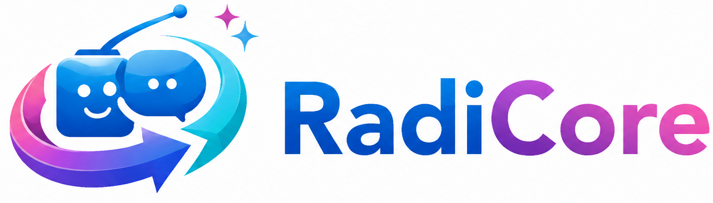

<div align="center">
  

  **radiko のタイムフリー録音・予約・ライブラリ管理を行うセルフホスト型 Web アプリケーション**

  *A self-hosted radiko (Japanese internet radio) timefree recorder, scheduler and web library.*

  
  
  
  
  [](LICENSE)
</div>

---

## 概要

RadiCore は、radiko の番組表を取り込み、指定した番組を自動で録音して Web 上のライブラリから再生・ダウンロードできるようにするアプリケーションです。自宅サーバーや VPS 上での常時稼働を想定しています。

録音は radiko の**タイムフリー**（放送済み番組の後追い再生）を利用します。radiko プレミアム会員のアカウントを設定すれば、**エリアフリー**によるエリア外番組の録音にも対応します。

> **旧名:** RadikoShift
> 2026年8月に RadiCore へ改名しました。旧リポジトリ URL からは自動でリダイレクトされます。

## 主な機能

| 機能 | 内容 |
|---|---|
| **番組表** | 全国の放送局の週間番組表を毎日自動取得。放送局・日付・キーワードで絞り込み |
| **予約録音** | 番組表から予約。単発（`Once`）／毎日（`Daily`）／毎週（`Weekly`）の繰り返しに対応 |
| **手動予約** | 番組表に無い時間帯を、放送局・日時を直接指定して予約 |
| **自動削除** | 繰り返し予約で、新しい録音の完了時に前回分を自動削除（任意設定） |
| **ライブラリ** | 録音済み番組の一覧・再生・ダウンロード・削除 |
| **Slack 通知** | 録音完了時とエラー発生時に Slack へ通知 |
| **設定画面** | 番組表更新時刻・取得並列数をブラウザから変更 |
| **ヘルスチェック** | `/healthz` でプロセスと DB 到達性を確認（デプロイ時のロールバック判定用） |

## 技術スタック

- **ランタイム** — .NET 10 / ASP.NET Core MVC
- **データベース** — PostgreSQL（Npgsql + Entity Framework Core 10、一括投入に Npgsql.Bulk）
- **ジョブスケジューラ** — Quartz.NET
- **録音** — ffmpeg / ffprobe（HLS セグメント取得とチャンク結合を委譲）
- **音声タグ** — z440.atl.core
- **通知** — SlackNet
- **フロントエンド** — Bootstrap 5 + 素の JavaScript（jQuery 非依存）

## 動作要件

| 要件 | 備考 |
|---|---|
| .NET 10 SDK / Runtime | ビルド時は SDK、実行のみなら ASP.NET Core Runtime |
| PostgreSQL | 動作確認は 18。`bytea` に録音データを格納するため容量に注意 |
| ffmpeg / ffprobe | **`PATH` 上に必要**。実行ファイル名で直接起動します |
| radiko プレミアムアカウント | 任意。エリアフリー録音を行う場合のみ |
| Slack Bot トークン | 通知に使用（後述の注意を参照） |

## セットアップ

### 1. データベースの準備

データベースを作成し、同梱のスキーマ定義を適用します。

```bash
createdb -U postgres radicore
```

```bash
psql -U postgres -d radicore -f docs/schema.sql
```

[docs/schema.sql](docs/schema.sql) は稼働中のデータベースから `pg_dump --schema-only` で出力したものです。EF Core Migrations は使用していないため、スキーマを変更した際はこのファイルを更新してください。

```bash
pg_dump -U noobow --schema-only --no-owner --no-privileges radicore > docs/schema.sql
```

`--no-owner --no-privileges` は特定ロールへの依存を除くためです。なお PostgreSQL 18 の `pg_dump` は先頭と末尾に `\restrict` / `\unrestrict` メタコマンドを出力しますが、古い psql クライアントで実行できなくなるため同梱ファイルからは除いてあります。

適用されるテーブルは以下の 7 つです。各カラムの意味はエンティティクラスを参照してください。

| テーブル | 定義 |
|---|---|
| `stations` | [Station.cs](RadiCore/Data/Station.cs) |
| `programs` | [Program.cs](RadiCore/Data/Program.cs) |
| `areas` | [Area.cs](RadiCore/Data/Area.cs) |
| `reservations` | [Reservation.cs](RadiCore/Data/Reservation.cs) |
| `recordings` | [Recording.cs](RadiCore/Data/Recording.cs) |
| `recording_audio_data` | [RecordingAudioData.cs](RadiCore/Data/RecordingAudioData.cs) |
| `app_settings` | [AppSetting.cs](RadiCore/Data/AppSetting.cs) |

> [!NOTE]
> `stations_staging` / `programs_staging` は `docs/schema.sql` に含まれません。番組表更新ジョブが実行のたびに `CREATE TABLE ... (LIKE ... INCLUDING ALL)` で作成し、完了時に破棄する一時テーブルのためです。


### 2. 環境変数

| 変数名 | 必須 | 内容 |
|---|:---:|---|
| `RADICORE_CONNECTION_STRING` | ✅ | Npgsql 接続文字列。例: `Server=host; Port=5432; User Id=user; Password=pass; Database=radicore;` |
| `SLACK_BOT_TOKEN` | ✅ | Slack Bot トークン（`xoxb-` で始まる） |
| `SLACK_NOTIFY_CHANNEL` | ✅ | 通知先チャンネル ID |
| `RADIKO_MAIL` | — | radiko プレミアムのメールアドレス。**未設定ならフリー（エリア内）モードで動作** |
| `RADIKO_PASS` | — | radiko プレミアムのパスワード |
| `ASPNETCORE_ENVIRONMENT` | — | `Production` / `Development` |

> [!NOTE]
> Slack 関連の変数は、未設定時のフォールバックを実装していません。通知を行わない運用にする場合は [RecordingJob.cs](RadiCore/Jobs/RecordingJob.cs) と [RefreshStationsAndPrograms.cs](RadiCore/Jobs/RefreshStationsAndPrograms.cs) の通知処理を調整してください。

### 3. ビルドと実行

```bash
dotnet run --project RadiCore/RadiCore.csproj
```

既定で `http://localhost:5000` を待ち受けます（[appsettings.json](RadiCore/appsettings.json) の Kestrel 設定）。

本番向けの発行は以下です。

```bash
dotnet publish RadiCore.slnx -c Release --property:PublishDir=/path/to/deploy
```

## アプリケーション設定

以下は環境変数ではなく、`app_settings` テーブルに保存され**設定画面から変更**できます。

| キー | 既定値 | 範囲 | 内容 |
|---|---:|---|---|
| `RefreshHour` | `6` | 0–23 | 番組表更新ジョブの実行時刻（時） |
| `RefreshMinute` | `0` | 0–59 | 同（分） |
| `ParallelCount` | `10` | 1–50 | 番組表取得の並列数 |

変更は Quartz のトリガーへ即時反映されます。DB へ到達できない起動時は既定値で続行します。

## 動作の仕組み

### 番組表の更新

Quartz の Cron トリガーで 1 日 1 回起動し、全放送局の週間番組表を取得します。反映は以下の手順で行い、取得途中の失敗で番組表が欠損するのを防ぎます。

1. `stations_staging` / `programs_staging` を `CREATE TABLE ... (LIKE ... INCLUDING ALL)` で作成
2. 取得結果を staging へ一括投入（Npgsql.Bulk）
3. `ALTER TABLE ... RENAME` で本テーブルと入れ替え、旧テーブルを破棄

> [!IMPORTANT]
> `programs.p_id` の既定値が参照する `stations_id_seq` は、**どのテーブルにも `OWNED BY` されていません**。これは意図的で、手順 3 で旧テーブルを `DROP` した際にシーケンスまで巻き込まれないようにするためです。スキーマを手で作り直す場合、このシーケンスに `OWNED BY` を付けると 2 回目の番組表更新で失敗します。

### 録音

予約時刻になると `RecordingJob` が起動し、radiko の認証（プレミアム設定時はエリアフリーログイン）を経て HLS プレイリストを取得します。実際のセグメント取得と結合は ffmpeg に委譲し、長時間番組はチャンク分割して結合します。

完成した m4a（`audio/mp4`）は **PostgreSQL の `recording_audio_data.audio_data`（bytea）に格納**されます。

> [!NOTE]
> 音声をファイルシステムではなく DB に格納するのは意図的な設計です。**バックアップとリストアを容易にすること**を目的としています。
>
> 音声データとメタデータが単一のデータベースに集約されるため、`pg_dump` 一回でバックアップが完結し、リストアも同様に一回で済みます。ファイルツリーと DB の整合性を別途管理する必要がなく、「DB には録音レコードがあるのにファイルが無い」といった不整合が原理的に発生しません。移設もダンプファイル 1 つで完了します。
>
> 反面、運用が長期化すると DB サイズは増大します。繰り返し予約の `auto_delete_previous`（前回分の自動削除）と併用して調整してください。

### 起動時の予約復元

`ReservationBootstrapService` が起動時に DB の予約を読み込み、Quartz へ再登録します。プロセス再起動をまたいで予約が維持されます。

## セキュリティ

> [!CAUTION]
> **本アプリケーションは認証・認可の機構を持ちません。** アクセス制御は前段のリバースプロキシに委ねる設計です。
>
> 作者の環境では Cloudflare Access を前段に置いています（画面のログアウトリンクが `/cdn-cgi/access/logout` を指すのはこのためです）。**インターネットに直接公開しないでください。**

`/healthz` も認証なしで応答します。判定対象はプロセスの応答性と DB 到達性のみで、radiko への到達性や録音ジョブの状態は含みません（外部要因の障害でデプロイがロールバックされるのを避けるため）。

## エンドポイント

| パス | 内容 |
|---|---|
| `/` | 番組表（既定画面） |
| `/Reservation` | 予約一覧・登録・編集 |
| `/Library` | 録音ライブラリ |
| `/Settings` | アプリケーション設定 |
| `/healthz` | ヘルスチェック |

## 開発

```bash
dotnet build RadiCore.slnx
```

テストは MSTest です。DB 接続を必要とするため、接続情報は `RadiCore.Test/test.runsettings` に定義します（このファイルは `.gitignore` 対象です）。

```bash
dotnet test RadiCore.slnx --settings RadiCore.Test/test.runsettings
```

## ライセンス

本プロジェクトは [MIT License](LICENSE) のもとで公開しています。

`RadiCore/Tools/rec_radiko_ts.sh` は uru 氏による [rec_radiko_ts](https://github.com/uru2/rec_radiko_ts) を同梱したもので、同じく MIT License です（[LICENSE](RadiCore/Tools/LICENSE)）。録音処理の C# 化に伴い**実行時には使用していません**が、radiko 側の仕様変更を追跡する参照実装としてソースツリーに残しています。

## 謝辞

- [uru2/rec_radiko_ts](https://github.com/uru2/rec_radiko_ts) — uru 氏によるシェルスクリプト実装。radiko のタイムフリー録音手順の参照実装として活用させていただきました。

## 免責

- 本ソフトウェアは作者個人の利用を主目的として開発されています。配布・汎用利用を前提とした作りにはなっていません。
- radiko の利用にあたっては [radiko の利用規約](https://radiko.jp/rule/)に従ってください。録音物の利用は私的使用の範囲に留めてください。
- 本ソフトウェアの使用によって生じたいかなる損害についても、作者は責任を負いません。
